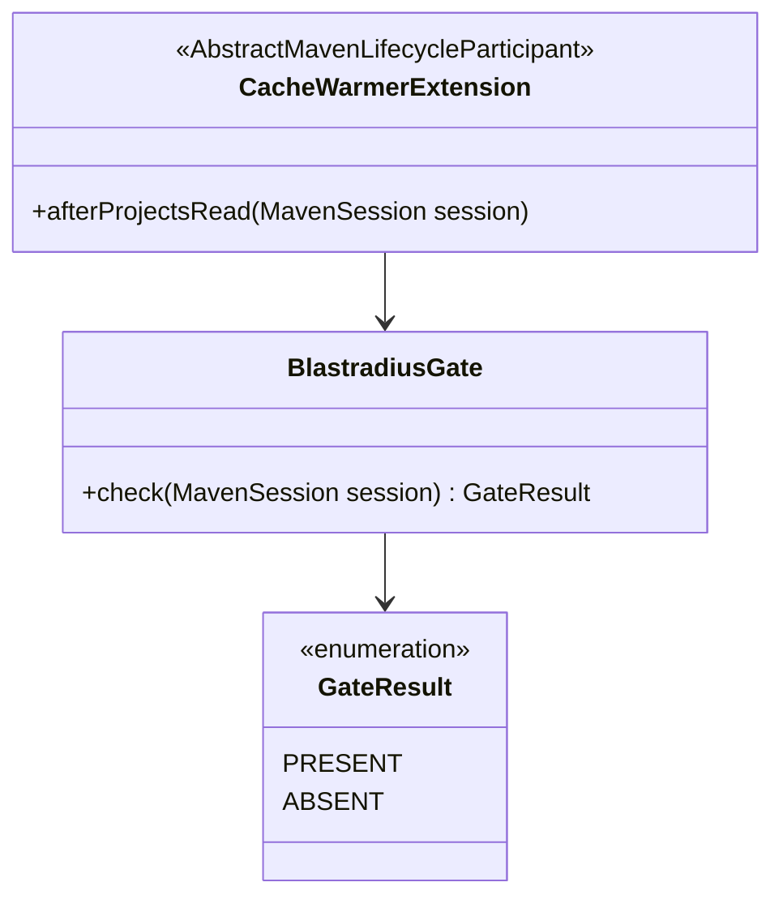
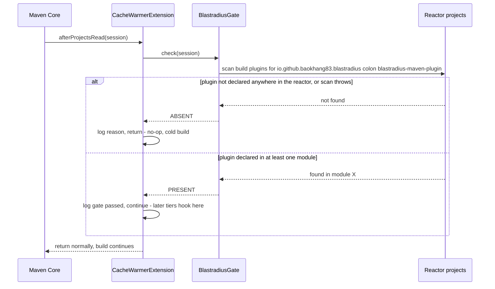

# Design: Maven Core Extension skeleton + BlastradiusGate (fail-open gate)

started: 2026-08-07
branch: feature/1-maven-core-extension-skeleton-blastradiusgate-fail-open-li

## Class diagram

## Sequence: gate check on the warm-path entry point

## Why this replaced the license-file design

The first pass of this design (published as an Artifact, not committed) gated on a
`.blastradius/license.json` file — a license/config format invented for this design, not
something blastradius actually has. Reading the real `~/Documents/blastradius` repo before
building corrected that:

- Blastradius is Apache-2.0, published in the open on Maven Central. There is no license
  concept anywhere in it to check.
- `.blastradius/` isn't even a flat gate file — `SelectMojo`'s real default
  (`indexPath = .blastradius/index.json`) gets the merge-base SHA spliced in before the
  filename, so the actual on-disk shape is `.blastradius/<sha>/index.json`. Hardcoding the
  literal path would have been wrong on top of being invented.
- The state that path holds is *transient* anyway — it may not exist yet on a fresh clone or a
  first CI run even for a real blastradius user, which is exactly the case this gate must not
  punish (fail open, §3).

**The correct gate signal is "is `blastradius-maven-plugin` declared in this reactor?"** — not
license validity, not index-file presence. That's what "only blastradius users get access to
cache-warmer" actually means in a hard-dependency world: presence of the sibling tool in the
same build, checked once against the reactor's effective plugin list. It has no corrupt/expired
states to model — a plugin is either declared or it isn't — so `GateResult` drops `INVALID`
entirely versus the first draft (constitution §2, simplicity: don't model a state that can't
occur).

## T1 scope boundary

This slice only builds the gate. When it passes, there is nothing yet for it to hand off to —
later tasks (T2-T7) fill that in. The extension's job here is proving Maven actually calls it,
at the right moment, and that an absent plugin (or any exception scanning for it) produces a
normal cold build with zero side effects.
