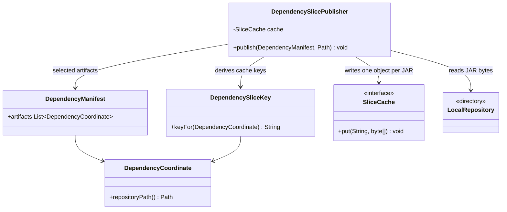
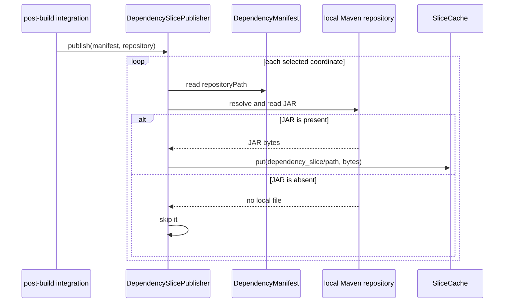

# Design: T10 Tier B publisher segmented third-party JAR upload

started: 2026-08-07
branch: feature/10-t10-tier-b-publisher-segmented-third-party-jar-upload

## Scope

T10 publishes the third-party JARs selected by T9, one cache object per Maven repository
path. It deliberately does not upload a second manifest: T9 reconstructs the same deterministic
`DependencyManifest` at both publication and restoration time. T11 will use that manifest to
derive the same object keys and restore only the JARs its module needs.

No live S3 account is required for this task. The publisher depends only on `SliceCache`, so
tests use an in-memory implementation and production storage remains a later configuration
choice.

## Class diagram

## Rationale

The unit of transfer is an individual JAR, not a ZIP containing every dependency and not a
separate remote manifest. The key helper keeps the key contract shared with T11. It returns
`dependency_slice/<Maven repository path>`, for example
`dependency_slice/org/junit/jupiter/junit-jupiter-api/5.10.2/junit-jupiter-api-5.10.2.jar`.
That path already uniquely describes Maven's local destination, is deterministic across CI
runners, and allows unrelated modules to reuse a previously published JAR. T11 can calculate it
from the same coordinate without listing or trusting remote storage.

Missing local JARs are skipped. A partially populated local Maven repository is a normal CI
state, and publishing only files that exist cannot make a later build incorrect: T11 will treat a
cache miss as a normal cold dependency resolution. This keeps the cache an optimization rather
than a prerequisite for a Maven build, consistent with constitution §3.

The publisher stays separate from `SlicePublisher`. Tier A and C archive output directories under
module-content keys, whereas Tier B reads individual Maven-repository files under coordinate
keys. Combining them would make one class own two incompatible key and payload contracts.

## Sequence: publish selected third-party JARs

## Verification

Unit tests will use a temporary local repository and a recording `SliceCache` to prove that the
publisher uploads each selected JAR under its path-derived key, preserves the JAR bytes, and
skips absent artifacts. No network or cloud credentials are involved.
