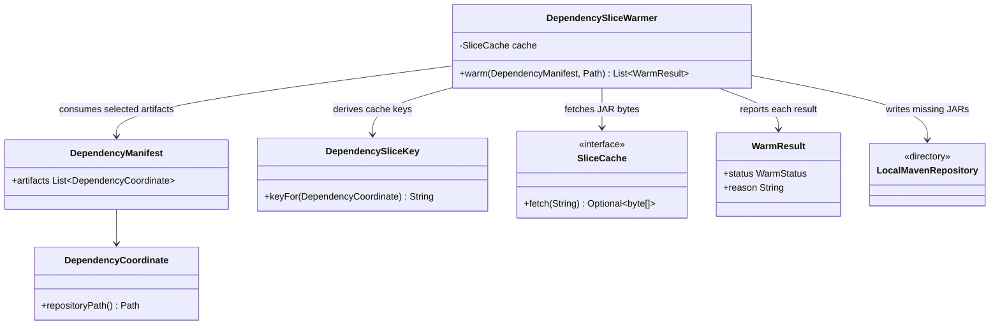
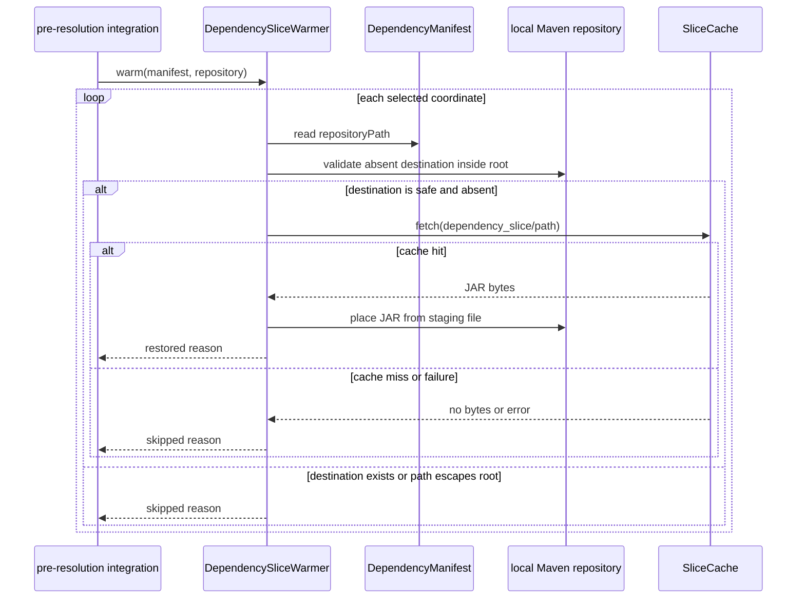

# Design: T11 Tier B warmer down-selected Maven repository restore

started: 2026-08-07
branch: feature/11-t11-tier-b-warmer-down-selected-maven-repository-restore

## Scope

T11 restores only the third-party JARs selected by T9's `DependencyManifest`. Each coordinate
maps to the same `DependencySliceKey` that T10 used for publication, and the fetched bytes are
placed at that coordinate's standard Maven local-repository path. The caller supplies the
already down-selected manifest and the local repository root.

This task is the Tier B restore primitive, not Core Extension lifecycle wiring. A future
integration caller will choose safe modules using T2, build their manifests, and call this warmer
before Maven dependency resolution.

## Class diagram

## Rationale

One `WarmResult` is returned for each manifest coordinate, rather than an all-or-nothing result.
Tier B can have a mixture of hits, misses, locally present JARs, and transient cache failures,
per-artifact reasons make that behavior observable and allow Maven to resolve only what remains
cold. A single aggregate result would hide which dependency did or did not benefit from the
cache.

The warmer writes only an absent destination inside the normalized local repository root. It
never replaces an existing Maven artifact, and it rejects a coordinate whose computed path escapes
that root. Cache failures, misses, and filesystem errors return `WarmResult.skipped` rather than
interrupting the build. That preserves the cache as an optimization and applies constitution
§3's fail-open rule.

T11 fetches raw JAR bytes rather than using `ArchiveRestorer`: T10 publishes individual JAR
objects, so there is no archive to unpack. The raw-file restore avoids inventing a second archive
format and uses Maven's repository path as the complete placement contract.

## Sequence: restore selected third-party JARs

## Verification

Temporary repository tests will prove that selected cache hits are restored at their exact Maven
paths, existing artifacts are preserved, cache misses and failures do not stop other entries, and
an escaping coordinate cannot write outside the supplied repository root.
