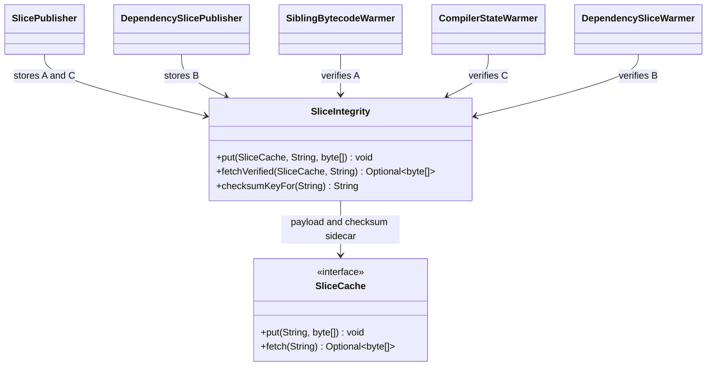
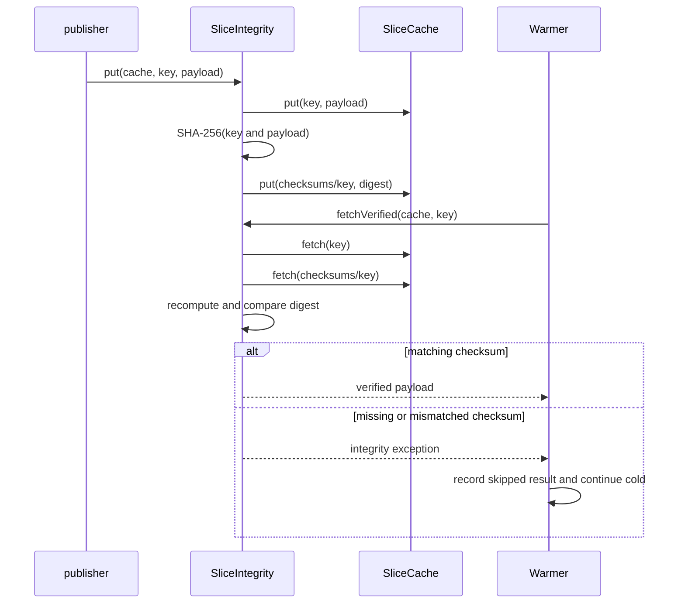

# Design: T12 integrity verification for every cached slice before restore

started: 2026-08-07
branch: feature/12-t12-integrity-verification-for-every-cached-slice-before

## Scope

T12 adds a SHA-256 checksum sidecar to every slice written by the Tier A/C and Tier B publishers.
Every warmer fetches and verifies that sidecar before restoring the payload. A missing, malformed,
or mismatched checksum becomes an explainable skip, leaving Maven to build cold.

## Class diagram

## Rationale

`SliceIntegrity` is the one protocol owner rather than duplicating digest logic in five callers.
Its `put` method writes each payload and a raw SHA-256 sidecar below the separate
`checksums/<key>` namespace. Its `fetchVerified` method retrieves both objects and compares the
stored digest with a digest recomputed from the requested key and payload bytes. Including the key
binds the payload to its intended cache location, so an object pair accidentally copied to another
key is rejected.

SHA-256 checksums detect transit or storage corruption and accidental cache mix-ups, but do not
prove publisher identity because a writer could replace both bytes and digest. Signature-key
management would be a separate operational contract that this project has not established. T13
will define the remaining writer-trust, IAM, and purge boundaries. Until then, any absent or
invalid sidecar is a safe cache rejection, never a restore.

## Sequence: verified publication and restore

