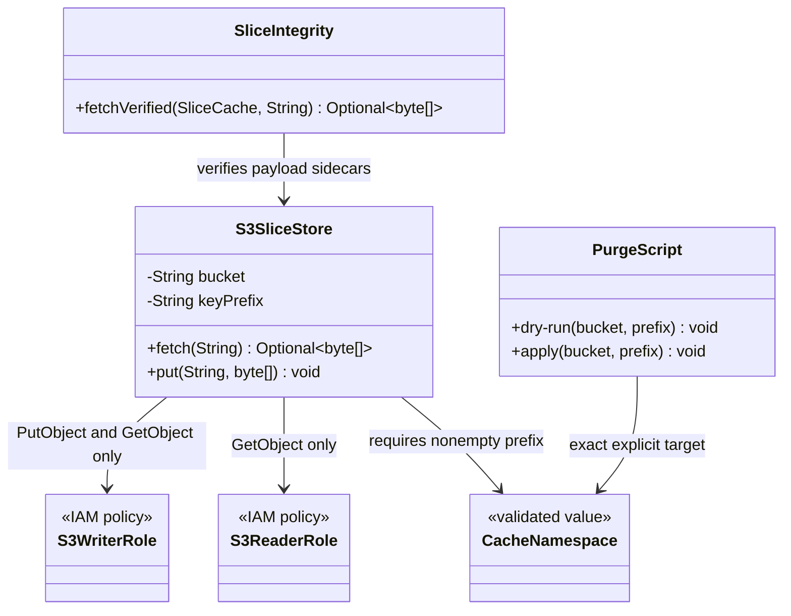
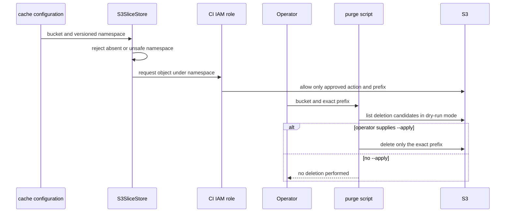

# Design: T13 security review for cache gating storage permissions and invalidation

started: 2026-08-07
branch: feature/13-t13-security-review-for-cache-gating-storage-permissions

## Scope

T13 turns the cache security review into three enforceable or operational boundaries:

- `S3SliceStore` requires an explicit, validated cache namespace rather than silently using a
  bucket root,
- `docs/security.md` describes the real trust boundary, least-privilege reader and writer roles,
  and the integrity limitation that T12 intentionally leaves to IAM,
- a purge script defaults to dry-run and requires an explicit `--apply` before it can delete a
  precisely named bucket prefix.

The blastradius plugin-presence gate remains a scope check, not an authorization mechanism. The
extension is not yet wired to remote storage, so this task establishes the contract integration
must follow rather than claiming that a POM declaration proves trust.

## Security rationale

The cache namespace is a safety boundary rather than an optional convenience. Requiring a
nonempty, normalized prefix in `S3SliceStore` means one configured cache can be mapped directly
to one narrow IAM resource ARN. It rejects the simpler empty-prefix alternative because a missing
setting must not silently broaden operations to an entire bucket.

The Maven plugin-presence gate is deliberately not used as security proof: repository metadata is
input to the build, not an identity that AWS can trust. CI should instead receive temporary
credentials through an IAM role that permits only `GetObject` for readers and `GetObject` plus
`PutObject` for writers under the configured namespace. A temporary, separately granted purge
role may use `DeleteObject` only under that namespace.

Purge is an exceptional recovery operation. Normal invalidation advances to a new versioned
namespace, keeping the previous objects intact for diagnosis and rollback. The purge helper
therefore previews the exact recursive target by default and performs deletion only with an
explicit `--apply` flag.

Integrity sidecars verify accidental corruption and key-payload mixups, but they do not
authenticate writers: a principal that can replace an object can replace its sidecar too. Narrow
IAM roles, private bucket controls, encrypted transport, and encryption at rest make that writer
trust boundary explicit.

## Class diagram

## Sequence: bounded cache use and purge

