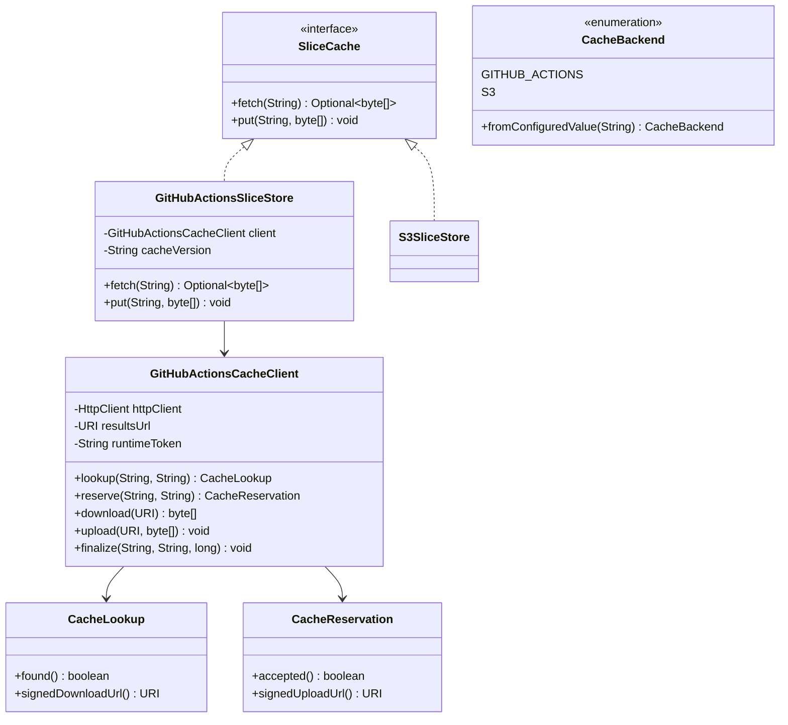
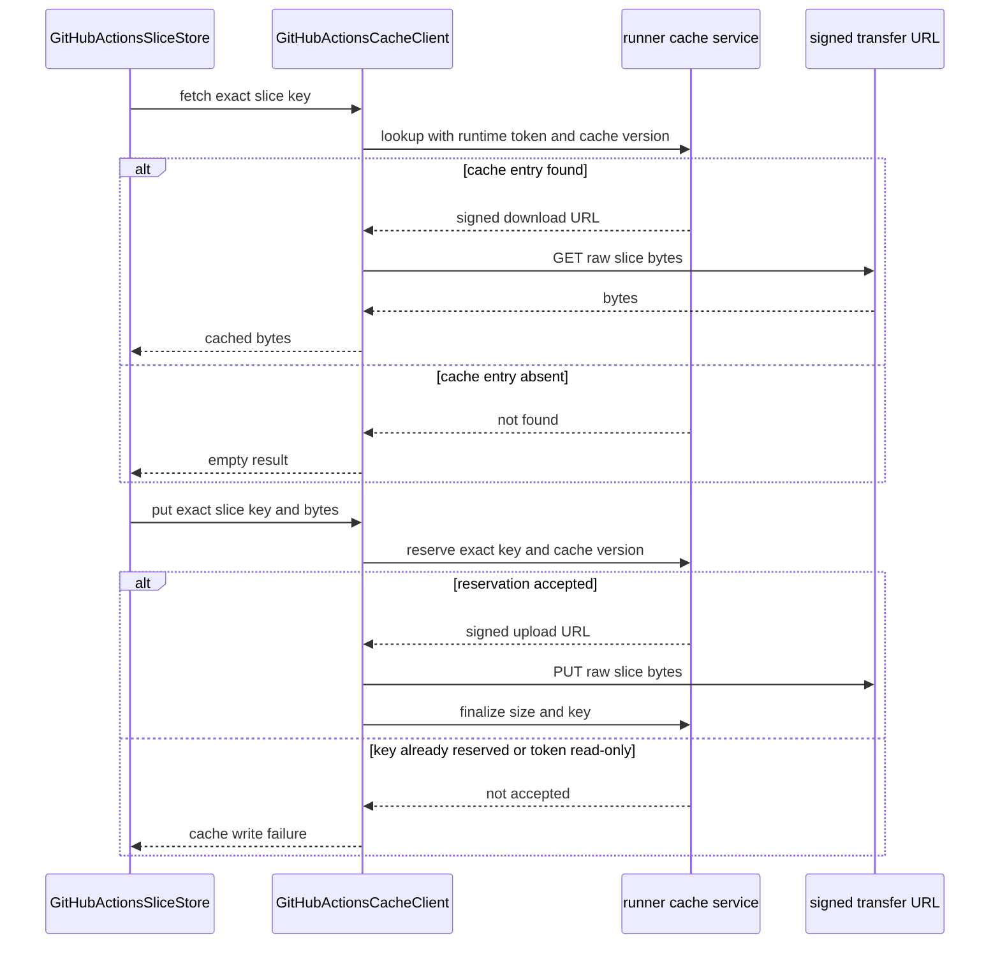
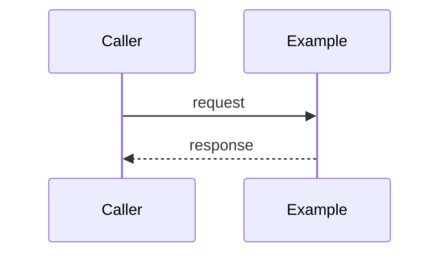

# Design: T14 GitHub Actions cache backend second SliceCache implementation

started: 2026-08-07
branch: feature/14-t14-github-actions-cache-backend-second-slicecache-implem

## Scope

T14 adds a GitHub Actions cache implementation of `SliceCache` and makes GitHub Actions the
documented default backend. S3 remains available only through an explicit backend choice. The
Maven core extension still does not create a cache store, so this feature supplies the storage
contract and selection default that later runtime wiring will consume.

The backend uses the current runner cache service rather than the repository cache-management
REST API. Inside a GitHub Actions job, the runner supplies a short-lived runtime token and result
service URL. The backend asks that service for a cache entry or a signed transfer URL, then moves
the raw slice bytes through the signed URL. No personal access token, static secret, or S3 account
is required.

## Class diagram

## Sequence: GitHub Actions cache flow

## Design call

`GitHubActionsCacheClient` contains the runner protocol and signed URL transfer details, while
`GitHubActionsSliceStore` keeps the established `SliceCache` contract. A fixed cache schema
version lets this backend invalidate all entries when its wire or payload interpretation changes.
`CacheBackend` resolves an absent setting to `GITHUB_ACTIONS`, while selecting `S3` requires the
explicit `blastradius.cache.backend=s3` setting.

The rejected approach is calling GitHub's public repository cache REST API directly. That API is
for listing and deleting caches, whereas an in-job cache read or write uses the runner-provided
cache service and its short-lived token. It would also force a long-lived token into build
configuration, contradicting the project security boundary.

## Approved rationale

GitHub Actions is the default cache backend because it is available to a workflow without a
separate S3 account or long-lived storage credential. The runner supplies a short-lived token and
cache service URL for the job, while signed transfer URLs confine the actual byte movement to one
reserved entry. The existing S3 backend remains an explicit opt-in for deployments that need it.

The protocol boundary stays in `GitHubActionsCacheClient`. Keeping `GitHubActionsSliceStore` as a
small `SliceCache` adapter prevents runner-specific HTTP, tokens, and response shapes from
spreading into publishers and warmers. A cache miss is represented as `Optional.empty()`, while a
failed protocol request remains a `SliceCacheException` so existing callers can fail open.

<!--
FluencyLoop Stage 2 — one design.md per feature, committed alongside it.
Defaults: a class diagram and a sequence diagram (the two first-class Mermaid types that
pay their way most often). Add an interaction/flow view only when it earns its place.
Keep the Mermaid blocks TOP-LEVEL (not nested in another code fence) so GitHub renders them.
Delete this comment once the diagrams are real.
-->

started: 2026-08-07
branch: feature/14-t14-github-actions-cache-backend-second-slicecache-implem

## Class diagram

## Sequence: <the main flow>

