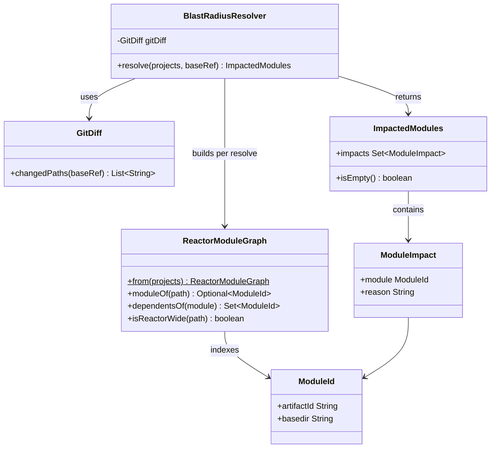
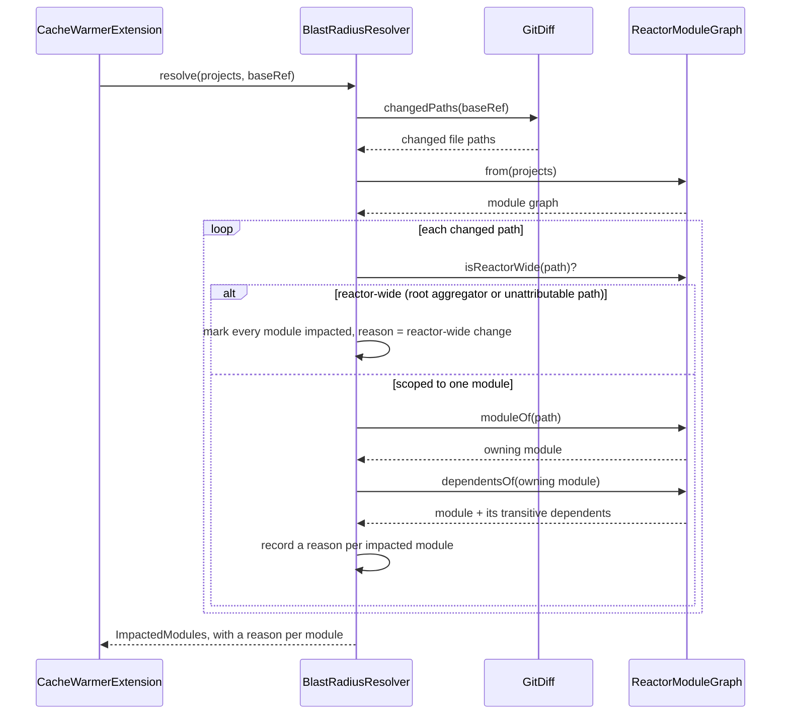

# Design: BlastRadiusResolver — git diff -> impacted module set, with reason

started: 2026-08-07
branch: feature/2-blastradiusresolver-git-diff-blastradius-map-impacted-modu

## Scope note — revised from plan.md

`plan.md`'s original sketch had `BlastRadiusResolver.impactedModules(gitDiff, blastradiusMap)`,
reusing blastradius's `.blastradius` test-to-class index. Investigating blastradius-core (its
`ReactorModuleGraph`, `ChangedFile`, `GitComparison`) before building surfaced two things:

1. blastradius-core already solves almost exactly this problem — a module dependency graph plus
   "module + everything that transitively depends on it" — but it builds that graph by parsing
   POMs out of the git tree, because blastradius's own validator has no live `MavenProject`.
   Cache-warmer is not in that position: `CacheWarmerExtension` already runs inside a real
   `MavenSession` (T1), which hands us `session.getProjects()` — every reactor module, already
   resolved, with real basedirs and real declared dependencies. Re-deriving that from git-tree
   POMs would be strictly worse information gotten the harder way.
2. The `.blastradius` map is a *test-to-class* index — the wrong granularity for "is this
   module's cached bytecode still safe to reuse," which only needs module-to-module dependency
   edges.

Decision (confirmed with the user): **BlastRadiusResolver builds its own module graph from the
live `MavenSession`, and gets the changed-file list via a `git` CLI subprocess — no dependency
on blastradius-core, no JGit.** Reusing blastradius-core directly was the alternative; it was
rejected because it would pull JGit + Jackson + ASM onto the Core Extension's shared classpath
(needing shading to avoid the collision risk T1 already flagged for `provided`-scope deps) in
exchange for logic we can get more simply and more accurately from data we already have.

## Class diagram

- `GitDiff` isolates the one `git` subprocess call so `BlastRadiusResolver` stays unit-testable
  without a real repo, the same seam `BlastradiusGate`/`CacheWarmerExtension` already use for
  testability (T1).
- `ReactorModuleGraph` is rebuilt fresh from `List<MavenProject>` per call — no caching across
  builds, nothing to invalidate, matches SS2's "simplest mechanism that satisfies the milestone."
- `ModuleImpact.reason` is a plain human-readable string, not a code — SS4 Explainability means a
  developer reading the log line understands *why* a module was pulled in without cross-
  referencing anything else.

## Sequence: resolving impacted modules

`isReactorWide` mirrors blastradius-core's own conservative fallback by name and by intent (a
path Maven's model can't confidently attribute to one module is treated as touching everything,
never guessed narrower) — same posture, independently implemented, no shared code.

## Reason strings (SS4 Explainability)

- Direct hit: `"changed: <path>"`
- Transitive: `"depends on <artifactId>, which changed via <path>"`
- Fallback: `"reactor-wide change: <path> (outside any module's basedir)"`

## Out of scope for this slice

- Actually warming anything from the result — T2 only produces `ImpactedModules`; T3+ consumes it.
- Wiring `BlastRadiusResolver` into `CacheWarmerExtension.applyGate` — kept as a follow-up slice
  once `resolve` itself is solid, same split T1 used between the gate and the extension.
