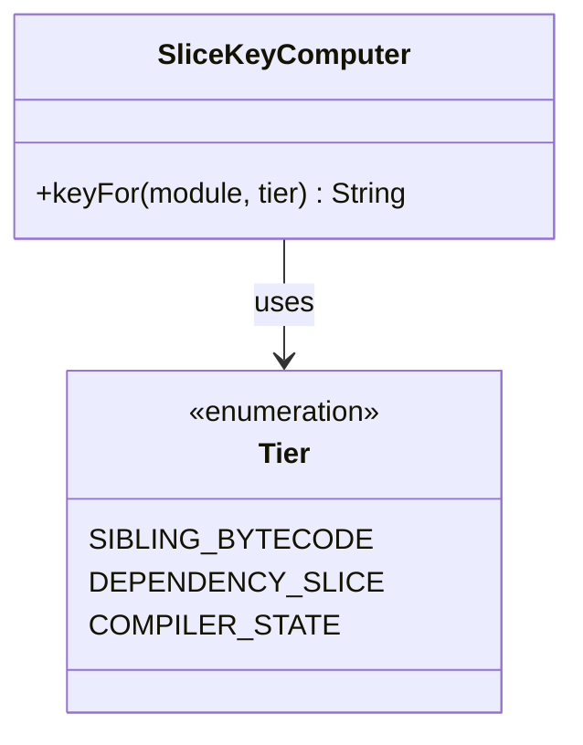
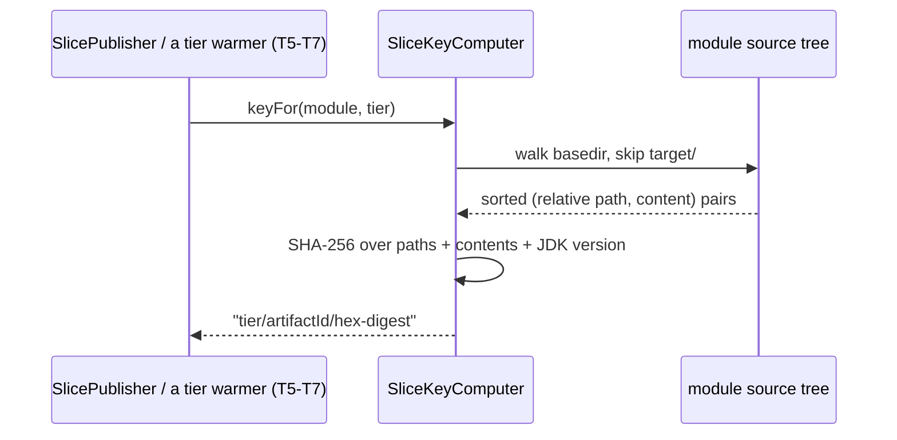

# Design: SliceKeyComputer — source-tree hash -> cache key, shared across tiers

started: 2026-08-07
branch: feature/3-slicekeycomputer-source-tree-hash-cache-key-shared-across

## Correction from the previous handoff

I closed T2 by calling T3 "Tier A: sibling bytecode warming" — that's wrong. Per `plan.md`'s
task table, **T3 is `SliceKeyComputer`** (size S, depends only on T1); the Tier A warmer is
**T6**, which depends on T2 *and* T3 *and* T4. T3 is small and self-contained, which is why it's
next on the critical path (`T1 -> T3 -> T4 -> T5 -> T8`) even though `BlastRadiusResolver` (T2)
doesn't feed into it at all.

## What this computes, and why content, not a commit SHA

`SliceKeyComputer.keyFor(module, tier)` hashes the module's own source tree - every file under
its basedir except `target/` (build output, not input), sorted by relative path for a
deterministic digest - plus the running JDK version, since Tier C (compiler state) and Tier A
(bytecode) are both toolchain-sensitive in ways a POM property doesn't always capture (a runner
image upgrade, not just a `maven.compiler.release` bump).

Keying off **content** rather than a git commit SHA is what makes the cache pay off across
branches: two branches whose changes never touch a given module still get the *same* key for
it, so a slice published from one branch's build is a legitimate hit for the other's - a commit
SHA would only ever hit on a later build of that exact commit.

## Class diagram

`Tier` names the manifesto's three tiers explicitly rather than passing around "A"/"B"/"C" -
SS2's naming standard (a name states what a thing *is*, not a code you'd have to look up).

## Sequence: computing a key

The same computer serves every tier (T5's publisher and T6/T7's warmers) - a publish and a
fetch for the same module+tier must derive the identical key independently, with nothing shared
at runtime except this class.

## Key format

`"<tier>/<artifactId>/<sha-256 hex>"` - e.g. `sibling_bytecode/core/9f2a...`. The tier and
artifactId prefix aren't inputs to the hash, so two modules with coincidentally identical source
trees still get distinct keys; they exist so the cache bucket layout stays human-inspectable
without decoding a bare hash (a mild SS4 Explainability assist, not this task's main job - that's
`BlastRadiusResolver`'s).

## Out of scope for this slice

- Tier B (dependency slices) - T9-T11 are a separate milestone with their own dependency-tree
  parser; this key format only needs to serve Tier A/C for the PoC milestone.
- Actually storing or fetching anything - `SliceCache`/S3 (T4) and the publisher/warmers
  (T5-T7) are later slices that call `keyFor`, not this one.
