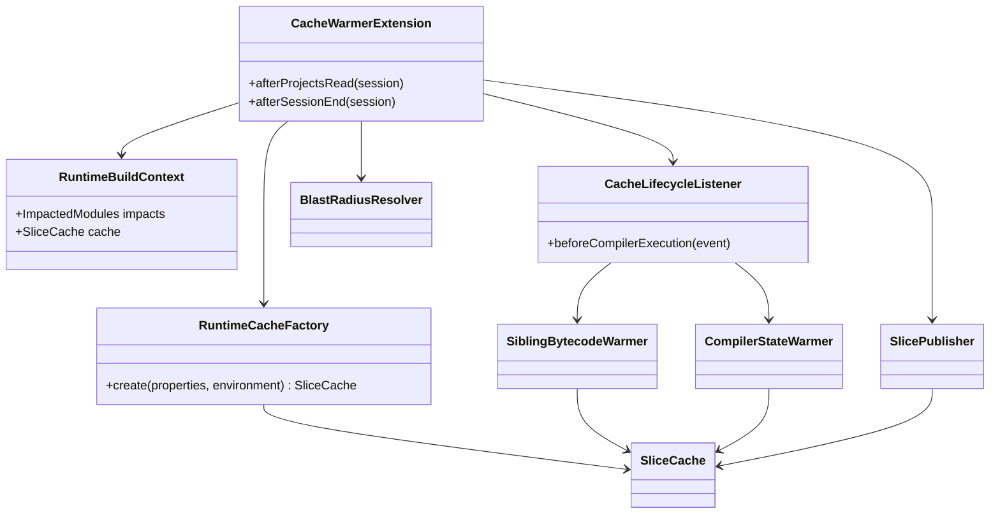
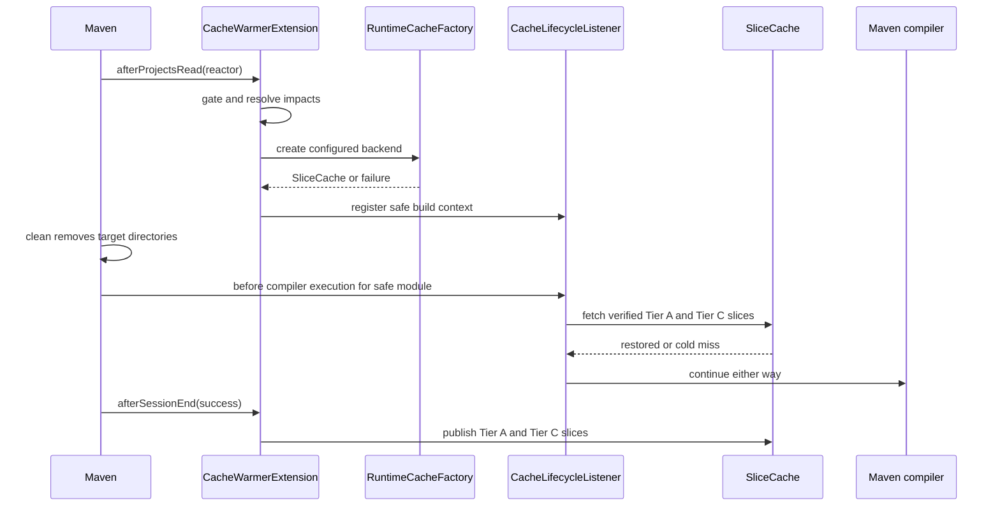

# Design: Wire cache warmer into the Maven runtime lifecycle

started: 2026-08-07
branch: feature/34-wire-cache-warmer-into-the-maven-runtime-lifecycle
issue: https://github.com/baokhang83/blastradius-cache-warmer/issues/34

## Goal

Make the existing Tier A and Tier C slice primitives take effect in a real Maven build while
preserving the cold-build fallback. Tier B is deliberately kept out of this first runtime path:
it needs a dependency manifest before Maven resolves dependencies, which is a separate lifecycle
and cache-key problem.

## Class diagram

## Sequence: successful `clean verify`

## Key decisions

1. Restore at the compiler boundary, not in `afterProjectsRead`. Maven runs `clean` after
   `afterProjectsRead` for the common `mvn clean verify` command, so an early restore would be
   deleted before compilation. A lifecycle listener restores each safe module after `clean` and
   immediately before the compiler can use its bytecode and incremental state.
2. Build the cache context once after the reactor is known. That combines the gate, backend
   configuration, and blast-radius result into one fail-open object rather than making every
   compiler invocation retry configuration or git work.
3. Publish only after a successful session. A failed build cannot be trusted to provide valid
   bytecode or compiler state, so `afterSessionEnd` publishes nothing unless Maven reports no
   exceptions.
4. Start with Tier A and Tier C. Tier B needs a resolved dependency manifest before resolution;
   inventing that at the pre-resolution hook would either recurse into Maven or weaken the cache
   key. It remains a follow-up slice once the manifest lifecycle is designed.

## Planned slices

1. Add the runtime configuration factory and build context, with fail-open configuration tests.
2. Register the compiler-boundary listener and restore Tier A and Tier C only for modules outside
   the blast radius.
3. Publish Tier A and Tier C after a successful session, add real Maven integration coverage, and
   update user documentation.
