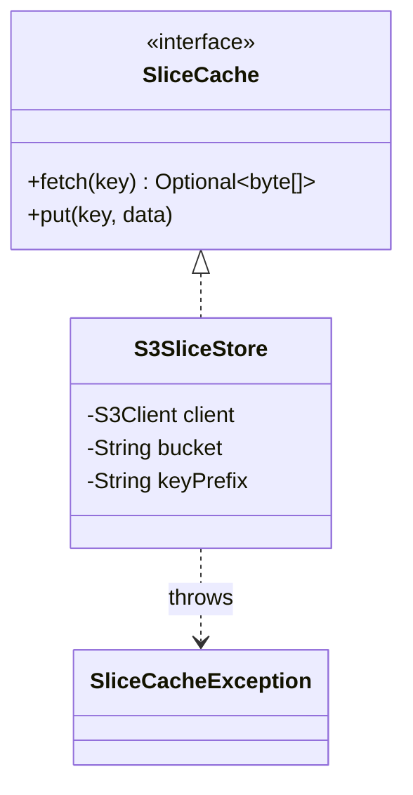
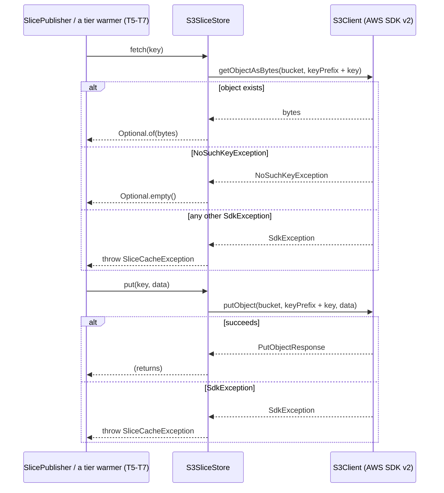

# Design: SliceCache abstraction + S3 backend

started: 2026-08-07
branch: feature/4-slicecache-abstraction-s3-backend

## Scope

Per `plan.md`'s task table, T4 is the storage abstraction the rest of the milestone builds on:
`SlicePublisher` (T5) writes through it, the Tier A/C warmers (T6/T7) read through it. T4 itself
knows nothing about *what* a slice contains (bytecode vs. compiler state) - it stores an opaque
byte payload at a string key. That split is what the plan's own constitution check commits to
(SS2, Simplicity): "`SliceCache` is kept to a two-method interface so S3/GHA backends swap
without leaking storage concerns into the tier warmers."

Two decisions were settled with you before drafting this: **AWS SDK v2** for the S3 client
(official SigV4 signing + credential chain, over hand-rolling that security-sensitive plumbing),
and **`byte[]`** for the payload type (slices are realistically tens of KB to a few MB - not
large enough yet to justify streaming's extra ceremony).

## Class diagram

`SliceCacheException` wraps every failure mode into one type the interface's contract can name -
a clean cache miss is `Optional.empty()`, never an exception; an exception always means "the
cache itself couldn't answer" (network, auth, a bucket that doesn't exist), which is a different
thing for a caller to react to.

## Sequence: fetch and put

The caller's own fail-open posture (constitution SS3) is what turns a thrown
`SliceCacheException` into "skip this restore, log why, build stays correct" - that reaction
lives in T5-T7, not here. T4's whole job is: never let a *transport* failure masquerade as a
clean miss, and never let a clean miss masquerade as an error.

## Reason strings (SS4 Explainability)

`SliceCacheException` messages always name the operation, the key, and the underlying SDK
exception's message - e.g. `"S3 fetch failed for key 'sibling_bytecode/core/9f2a...': <SDK
message>"` - so a caller that logs the exception (rather than swallowing it) produces something
a human can act on without re-running the request by hand.

## Out of scope for this slice

- Any actual publish/restore logic, or knowing what bytes represent (T5-T7).
- Wiring credentials/bucket/region configuration into `CacheWarmerExtension` - `S3SliceStore`
  takes an already-built `S3Client` plus a bucket and key prefix; who constructs the `S3Client`
  (default credential chain, region resolution) is a later integration concern, same pattern as
  `BlastRadiusResolver` (T2) not yet being wired into the extension.
- The GitHub Actions cache backend (`GhaSliceStore`) - T14, its own milestone.
- Integrity verification (checksums/signatures on fetched slices) - T12, a separate task that
  sits *after* a successful `fetch`.
