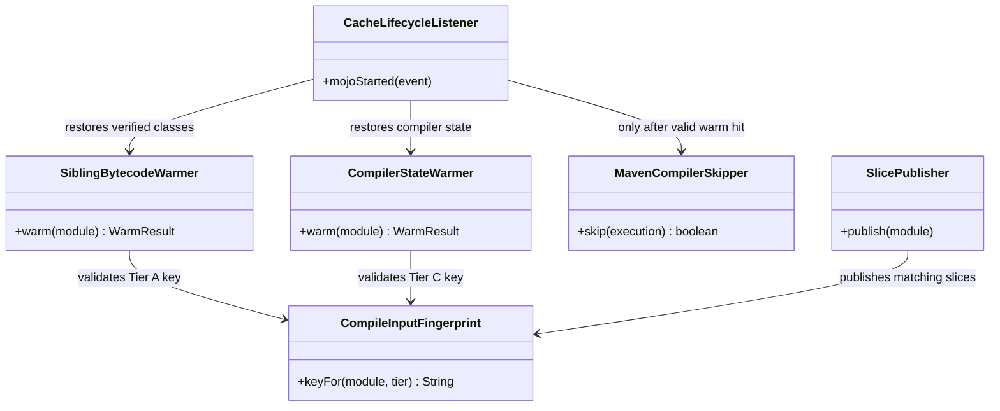
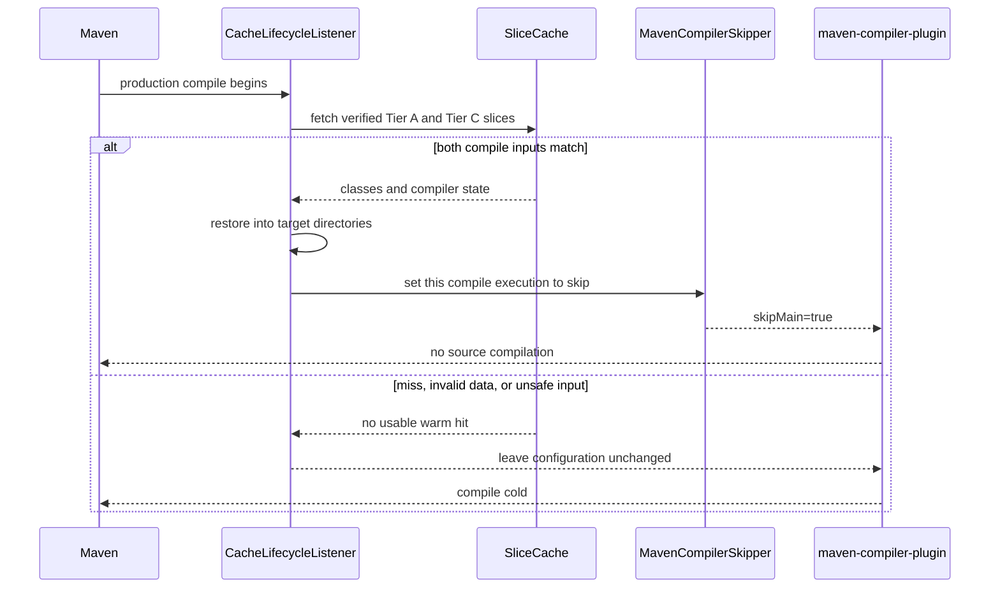

# Design: Make valid compiler cache hits skip Maven compilation in clean CI

started: 2026-08-08
branch: feature/41-make-valid-compiler-cache-hits-skip-maven-compilation-in

## Intent

Turn an exact, safe Tier A cache hit into a real Maven compile skip on a clean CI runner.
The current archive restore makes output files available, but Maven still applies its
timestamp-based stale-source test and recompiles them.

## Class diagram

## Sequence: safe warm compile

## Decisions

1. **Use an explicit per-execution compiler skip after verified restoration.** The cache key
   remains the validity boundary, and the listener changes only the matching production compile
   execution. This avoids relying on checkout and archive modification times, which Maven can
   legitimately treat as stale on an ephemeral runner.
2. **Require a complete compile warm hit.** Tier A bytecode and Tier C compiler state must both
   restore successfully before skipping. Any miss, integrity failure, malformed archive, or
   configuration error leaves Maven unchanged and cold, preserving constitution §3.
3. **Strengthen the compile-input fingerprint before trusting the skip.** The key must cover the
   effective compiler configuration as well as the module source tree and JDK. A parent POM or
   compiler-option change must become a miss, not a reused class directory.

## Rejected alternative

Preserving or rewriting archive modification times would continue to depend on Maven's internal
stale-source heuristic and the runner checkout timing. It is less explicit and less testable than
setting the compiler's skip flag only after the cache validity checks pass.
