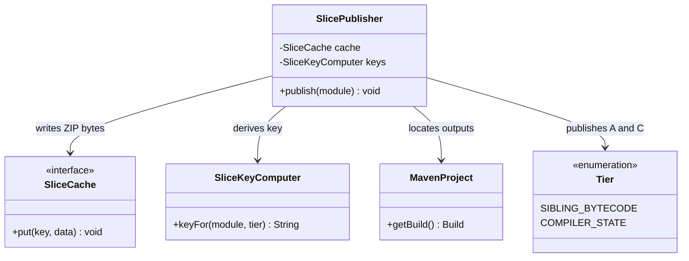
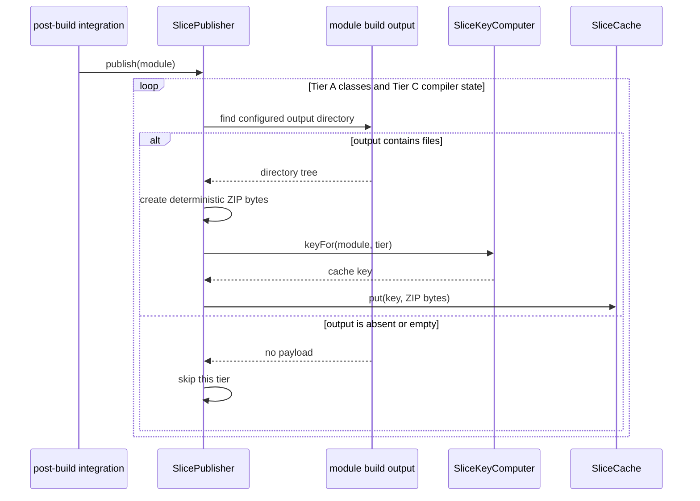

# Design: T5 SlicePublisher for Tier A/C post-build upload of bytecode and compiler state

started: 2026-08-07
branch: feature/5-t5-slicepublisher-for-tier-a-c-post-build-upload-of-byteco

## Scope

T5 turns the two Maven outputs that later warmers consume into one opaque payload per tier:
the compiled production classes (Tier A) and the compiler's incremental state (Tier C). It is
the producer half of the cache contract from T3 and T4. Lifecycle wiring and cache
configuration remain separate integration work because T4 deliberately does not yet decide how
to construct a configured `SliceCache` in the core extension.

## Class diagram

`SlicePublisher` depends only on the two existing contracts: `SliceKeyComputer` chooses the
same module-plus-tier key future warmers will read, while `SliceCache` persists an opaque byte
array. The publisher knows the Maven output locations and archive format; the cache does not.

## Sequence: post-build publication

## Key design choice

Each tier is stored as one ZIP payload, rather than putting every output file under separate
cache keys. A tier-level archive keeps the existing two-method `SliceCache` opaque and makes a
publication atomic from the cache's perspective: a future warmer sees one complete candidate,
not a partially published directory plus a manifest protocol. The tradeoff is that T6/T7 must
later unpack the archive safely, including rejecting path traversal entries, but that validation
belongs on the restore boundary (T12) rather than in this producer-only task.

The publisher asks Maven's `Build` model for its output and build directories instead of assuming
literal `target` paths. That preserves the normal Maven configuration contract for reactors that
customize their build directory.

## Out of scope

- Wiring `publish` into `CacheWarmerExtension.afterSessionEnd` and constructing/configuring an
  S3 cache. The extension currently has no cache configuration seam; adding one would conflate
  T5's producer with a separate integration decision.
- Restoring archives, validating their integrity, or preventing ZIP-slip on input. Those are the
  T6/T7 and T12 consumer-side responsibilities.
- Tier B dependency slices, which are intentionally deferred to T9/T10.
