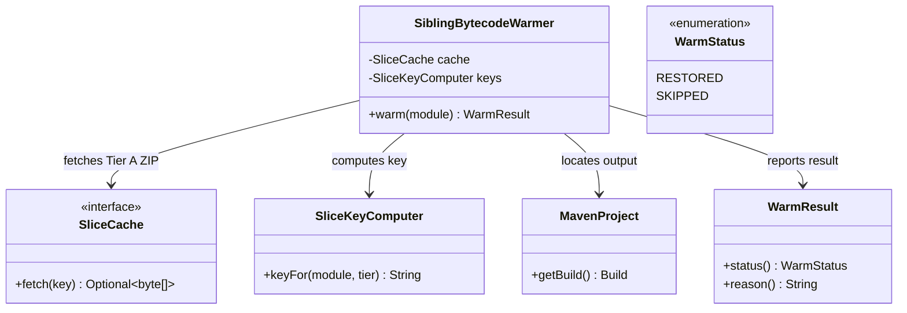
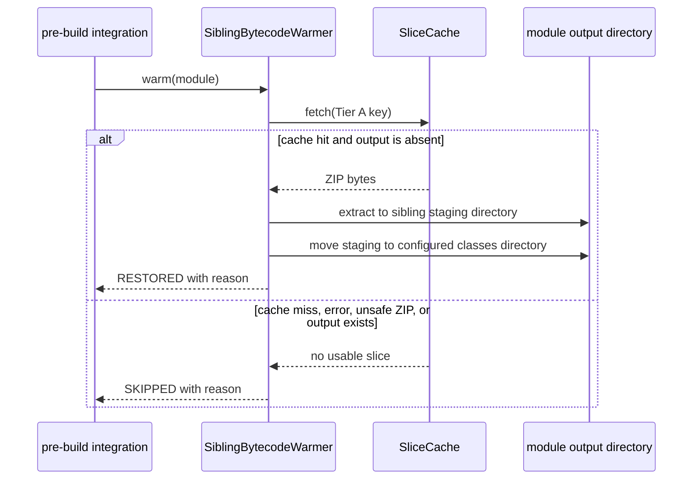

# Design: T6 Tier A warmer sibling bytecode restore into target/classes

started: 2026-08-07
branch: feature/6-t6-tier-a-warmer-sibling-bytecode-restore-into-target-clas

## Scope

T6 restores a single module's Tier A bytecode candidate. Its caller uses T2's blast-radius
result to invoke it only for modules that are safe to warm. T6 itself is deliberately focused on
the cache-to-filesystem boundary: it fetches the Tier A payload T5 published and reports a
human-readable `RESTORED` or `SKIPPED` result for the eventual extension integration to log.

## Class diagram

## Key design choice

The archive is extracted into a fresh staging directory beside Maven's configured classes
directory. Each entry resolves under that staging root after normalization; an absolute or
traversing entry is rejected. Only after a complete extraction does the warmer move the staged
tree into the absent output location. Direct extraction into `target/classes` is rejected because
a malformed archive or an I/O error could leave partial bytecode in a place Maven may consume.

The warmer does not replace an existing output tree. At its intended pre-build point a clean
runner has no classes directory; if that precondition is not true, preserving the existing files
and returning `SKIPPED` is safer than deleting potentially valid local output. The Maven `Build`
model provides the output location, so custom build layouts work without assuming literal
`target/classes`.

## Out of scope

- Selecting which modules are safe to warm or wiring this class into `CacheWarmerExtension`; T2
  owns the former and a later integration slice owns the latter.
- Integrity and authenticity verification of cache bytes; T12 adds that check before restore.
- Tier C compiler state restoration, which is T7.

## Sequence: restoring a sibling bytecode slice

