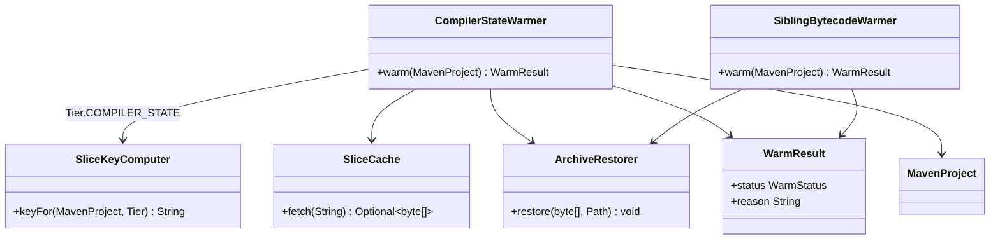
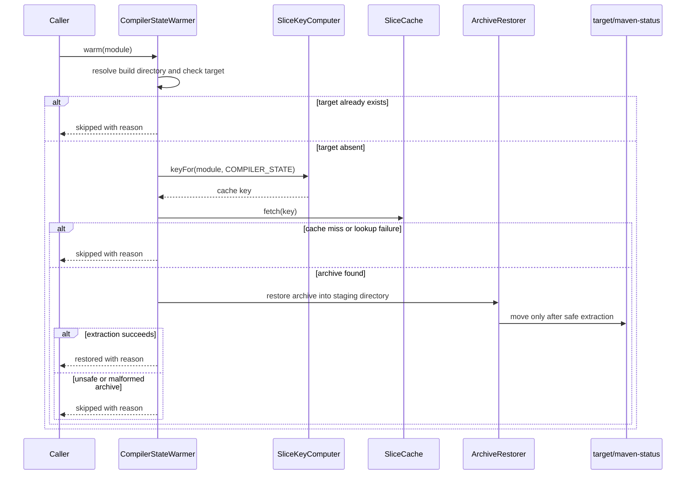

# Design: T7 Tier C warmer incremental compiler state restore into target/maven-status

started: 2026-08-07
branch: feature/7-t7-tier-c-warmer-incremental-compiler-state-restore-into-t

## Class diagram

## Sequence: restore compiler state

## Rationale

`target/maven-status` is Maven Compiler Plugin bookkeeping, not bytecode. The warmer restores it
only when the destination is absent, so it never overwrites compiler state already produced by a
local build. Any failed key computation, cache lookup, missing cache entry, malformed archive, or
unsafe archive entry returns a skipped `WarmResult` and leaves Maven to perform a cold compile.

Tier A and Tier C use the same ZIP restoration safety boundary. `ArchiveRestorer` extracts into a
sibling staging directory, rejects entries that escape it, and moves the completed tree into place
only after successful extraction. A shared helper keeps that behavior identical for both warmers.
Duplicating the ZIP code in the Tier C warmer was rejected because future correctness or security
fixes could otherwise diverge.
