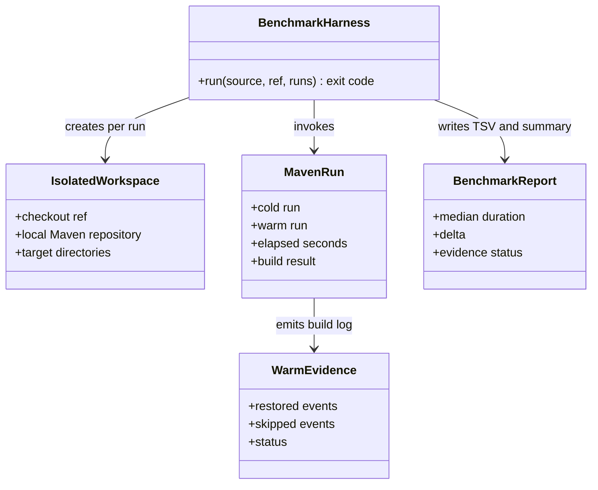
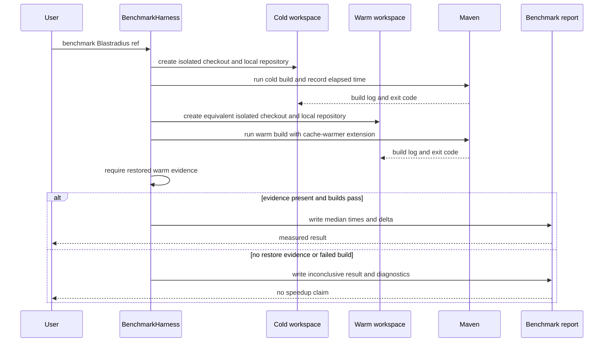

# Design: T8 PoC benchmark harness on a real monorepo run

started: 2026-08-07
branch: feature/8-t8-poc-benchmark-harness-on-a-real-monorepo-run

## Class diagram

## Rationale

The harness compares equivalent cold and warm Blastradius checkouts. Each measured run receives a
fresh checkout and a copy of the same pre-populated Maven repository, keeping dependency download
time outside this Tier A/C measurement. It records the Maven exit code, elapsed time, and
cache-warmer output for every trial, then reports medians only when the builds pass.

A timing delta is meaningful only when the warm build log proves that cache state was restored.
Without that evidence, the report is inconclusive and exits nonzero rather than attributing a
change caused by normal variation or Blastradius test selection to cache warming. This matters for
the current code because the Core Extension still gates but does not invoke the publisher or
warmers. Timing-only reporting was rejected because it would allow a false performance claim.

## Sequence: compare the same Blastradius revision

