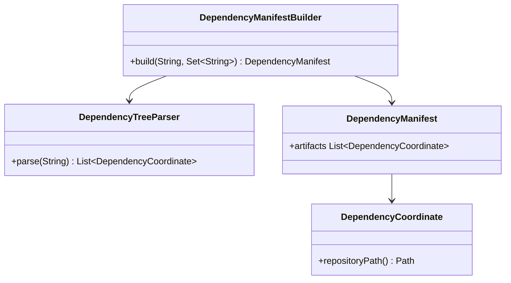
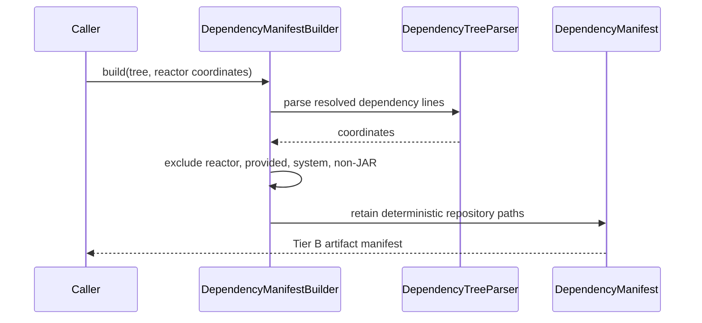

# Design: T9 dependency-tree parser and Tier B slice manifest builder

started: 2026-08-07
branch: feature/9-t9-dependency-tree-parser-and-tier-b-slice-manifest-builde

## Class diagram

## Rationale

The manifest is a deterministic list of resolved third-party JAR coordinates and their Maven
repository paths. Test scope stays included because the intended CI build runs tests. Reactor
modules, provided and system dependencies, and non-JAR artifacts are excluded because Tier B must
not overwrite project outputs or restore environment-supplied dependencies. A structured manifest
is retained instead of raw dependency-tree text so publishing and warming can address exact files.

## Sequence: build a Tier B manifest

