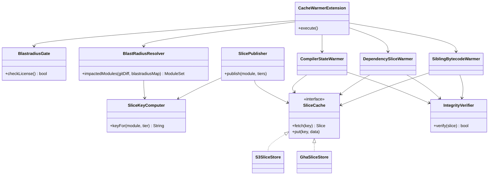
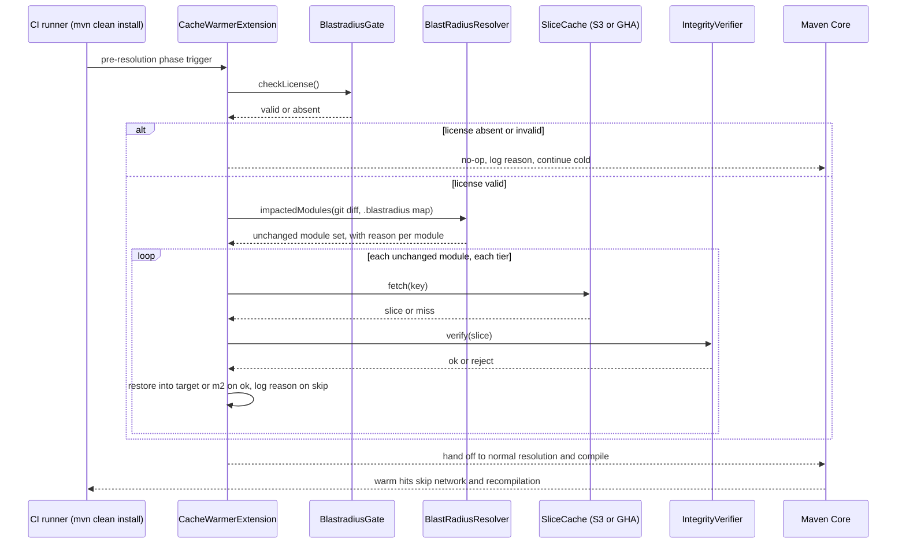

# Plan: Blastradius Cache Warmer: Maven Core Extension that pre-warms sibling bytecode, segmented dependency slices, and incremental compiler state in CI, gated as a blastradius-only add-on

started: 2026-08-07

## Goal & scope

- **Goal:** Cut the 2-5 minutes ephemeral CI runners waste on dependency download, sibling
  recompilation, and lost compiler-incremental-state, by pre-warming only the slices a change's
  blast radius actually needs — as a hard-gated add-on that only runs for licensed blastradius
  users.
- **In scope:**
  - Maven Core Extension (`AbstractMavenLifecycleParticipant`, pre-resolution phase hook).
  - All 3 manifesto tiers: sibling bytecode (`target/classes`), segmented third-party deps
    (`~/.m2/repository`), incremental compiler state (`target/maven-status`).
  - Blast radius boundary computed from git diff + blastradius's own `.blastradius` map (hard
    dependency — this tool does not work without blastradius installed and licensed).
  - Gating: presence + validity of blastradius's existing local license/config. **Fails open** —
    missing or invalid license means a silent no-op, build proceeds cold, never fails the build.
  - Pluggable slice storage: S3 as the first backend, GitHub Actions cache as a second backend
    option.
  - Single org (your team's monorepo) for the whole roadmap below.
  - A security-hardening milestone: integrity verification of every slice before it's restored
    into a build, since this system injects unreviewed binaries into someone else's compile.
- **Out of scope / non-goals (for this plan):**
  - Multi-tenant / external productization — no cross-org cache isolation, no billing, no
    self-serve onboarding. Revisit only if you decide to expand beyond your own team.
  - Gradle support is **not** part of the PoC or Security milestones — it's parked as its own
    later milestone (§ Roadmap) once the Maven path is proven and secured.
  - Standalone (non-blastradius) usage. The hard dependency is intentional — this is explicitly
    a blastradius add-on, not a general-purpose Maven cache tool.
  - IDE integration, non-Maven build tools generally.

## Architecture

<!-- initiative-altitude shapes: components + the warm-path flow. Per-tier restore mechanics
belong in each task's own design.md. -->

## Task breakdown

| id  | task (feature intent)                                                          | size | depends on |
|-----|---------------------------------------------------------------------------------|------|------------|
| T1  | Maven Core Extension skeleton + BlastradiusGate (fail-open license check)       | S    | —          |
| T2  | BlastRadiusResolver — git diff + `.blastradius` map -> impacted module set, with reason | M | T1     |
| T3  | SliceKeyComputer — source-tree hash -> cache key, shared across tiers           | S    | T1         |
| T4  | SliceCache abstraction + S3 backend                                             | M    | T1         |
| T5  | SlicePublisher for Tier A/C — post-build upload of bytecode + compiler state    | M    | T3, T4     |
| T6  | Tier A warmer — sibling bytecode restore into `target/classes`                  | M    | T2, T3, T4 |
| T7  | Tier C warmer — incremental compiler state restore into `target/maven-status`   | S    | T2, T3, T4 |
| T8  | PoC benchmark harness on a real monorepo run (measure actual time saved)        | S    | T5, T6, T7 |
| T9  | Dependency-tree parser + Tier B slice manifest builder                          | M    | T3         |
| T10 | Tier B publisher — segmented third-party jar upload                             | M    | T9, T4     |
| T11 | Tier B warmer — down-selected `.m2` restore                                     | L    | T9, T10, T2|
| T12 | Integrity verification — checksum/signature on every slice before restore       | M    | T4         |
| T13 | Security review — gating spoofability, bucket/IAM permissioning, purge/invalidation tooling | M | T1, T4, T12 |
| T14 | GitHub Actions cache backend (second `SliceCache` implementation)               | M    | T4         |
| T15 | Gradle support (Tier A/C first) — separate extension mechanism, reuses resolver/key/cache | L | T2, T3, T4 |

## Roadmap & critical path

- **Milestone 1 — PoC (Tier A + C, S3 only):** T1, T2, T3, T4, T5, T6, T7, T8. Goal: prove real
  time savings on your own monorepo with the two tiers that don't need dependency-tree parsing.
- **Milestone 2 — Tier B (dependency segmentation):** T9, T10, T11. The most novel, least
  precedented tier — worth its own milestone once A/C have proven the plumbing works.
- **Milestone 3 — Security hardening:** T12, T13. Gates anything beyond your own supervised use —
  do this before any teammate other than you relies on a warm build being correct.
- **Milestone 4 — Alternate storage backend:** T14 (GitHub Actions cache), for repos/teams that'd
  rather not stand up S3.
- **Milestone 5 — Gradle support (future):** T15. Explicitly post-PoC; only pursue if you decide
  to expand.

**Critical path: T1 -> T3 -> T4 -> T5 -> T8.**

This is the chain worth watching, and it runs through the *publish/storage* plumbing, not
through any individual tier warmer. T2, T6, T7 can all be built in parallel once T1 lands — but
none of them can be **validated** against a real speedup number until T5 has actually pushed real
slices somewhere and T8 measures a real restore. Building three warmers in parallel doesn't
shorten the PoC if the publish path is still the bottleneck; T3 -> T4 -> T5 is what actually gates
"does this work at all." T12 -> T13 (security) can run in parallel off T4 rather than waiting for
T8, since integrity verification only needs a working cache client, not a finished warmer.

## Constitution check

This plan is the constitution's birth (see below) — these are the principles the architecture
above already commits to, not aspirational extras:

- **§1 (TDD)** — every restore-path task (T5-T7, T9-T12) is untested-code-doesn't-merge by
  definition here: an unverified restore path fails silently as a *correctness* bug, not a build
  crash, which is the worst kind to catch after the fact.
- **§2 (Simplicity)** — `SliceCache` is kept to a two-method interface so S3/GHA backends swap
  without leaking storage concerns into the tier warmers; Gradle support and multi-tenancy are
  deliberately parked in their own milestones instead of designed in now.
- **§3 (Safety over speed)** — the sequence diagram's `alt` branch is load-bearing: gate,
  fetch, and verify all fail open to a cold correct build rather than a fast wrong one.
- **§4 (Explainability)** — `BlastRadiusResolver` and every tier warmer return/log a *reason*
  per module (why it was warmed or skipped), not just a boolean — this is a design commitment for
  T2, T6, T7, T11, not an afterthought.

## Tickets

Filed as GitHub issues under 5 milestones (one per roadmap milestone, §Roadmap):

- **[M1 — PoC (Tier A + C, S3 only)](https://github.com/baokhang83/blastradius-cache-warmer/milestone/1)** — T1-T8
  - [#1 T1](https://github.com/baokhang83/blastradius-cache-warmer/issues/1) Maven Core Extension skeleton + BlastradiusGate
  - [#2 T2](https://github.com/baokhang83/blastradius-cache-warmer/issues/2) BlastRadiusResolver
  - [#3 T3](https://github.com/baokhang83/blastradius-cache-warmer/issues/3) SliceKeyComputer
  - [#4 T4](https://github.com/baokhang83/blastradius-cache-warmer/issues/4) SliceCache abstraction + S3 backend
  - [#5 T5](https://github.com/baokhang83/blastradius-cache-warmer/issues/5) SlicePublisher for Tier A/C
  - [#6 T6](https://github.com/baokhang83/blastradius-cache-warmer/issues/6) Tier A warmer
  - [#7 T7](https://github.com/baokhang83/blastradius-cache-warmer/issues/7) Tier C warmer
  - [#8 T8](https://github.com/baokhang83/blastradius-cache-warmer/issues/8) PoC benchmark harness
- **[M2 — Tier B (dependency segmentation)](https://github.com/baokhang83/blastradius-cache-warmer/milestone/2)** — T9-T11
  - [#9 T9](https://github.com/baokhang83/blastradius-cache-warmer/issues/9) Dependency-tree parser + slice manifest builder
  - [#10 T10](https://github.com/baokhang83/blastradius-cache-warmer/issues/10) Tier B publisher
  - [#11 T11](https://github.com/baokhang83/blastradius-cache-warmer/issues/11) Tier B warmer
- **[M3 — Security hardening](https://github.com/baokhang83/blastradius-cache-warmer/milestone/3)** — T12-T13
  - [#12 T12](https://github.com/baokhang83/blastradius-cache-warmer/issues/12) Integrity verification
  - [#13 T13](https://github.com/baokhang83/blastradius-cache-warmer/issues/13) Security review
- **[M4 — Alternate storage backend](https://github.com/baokhang83/blastradius-cache-warmer/milestone/4)** — T14
  - [#14 T14](https://github.com/baokhang83/blastradius-cache-warmer/issues/14) GitHub Actions cache backend
- **[M5 — Gradle support (future)](https://github.com/baokhang83/blastradius-cache-warmer/milestone/5)** — T15
  - [#15 T15](https://github.com/baokhang83/blastradius-cache-warmer/issues/15) Gradle support
